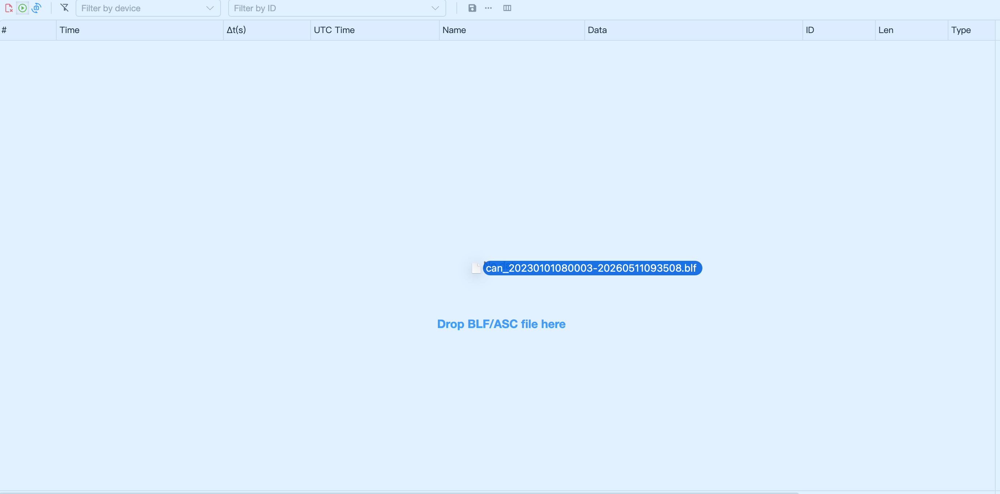
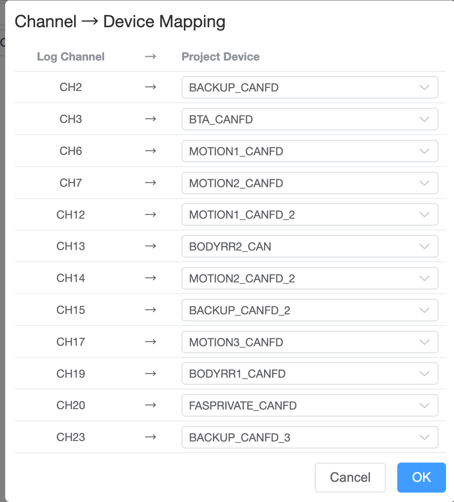
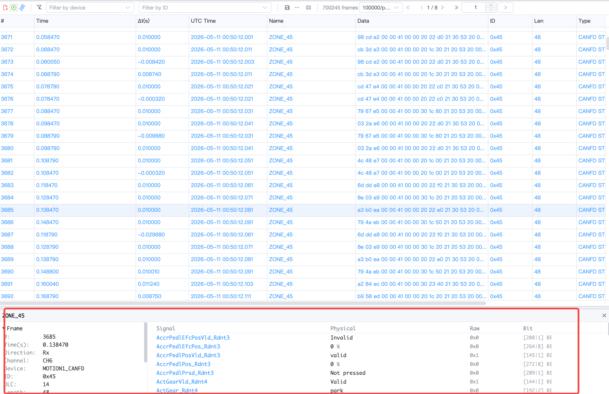
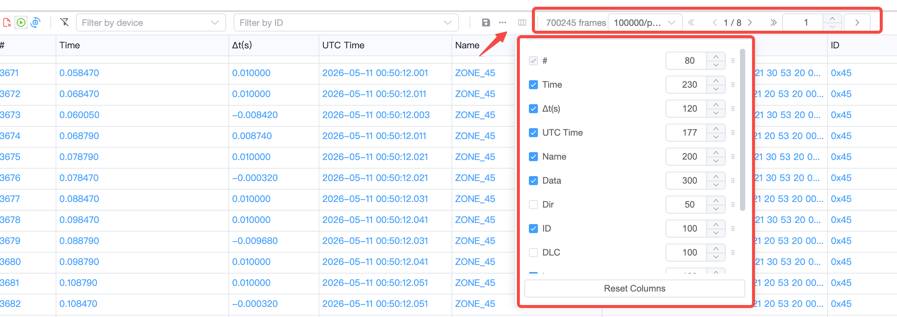

# Trace

The Trace window provides an interface for viewing and exporting data. Users can save data through buttons on the toolbar for further analysis or archival purposes.

>[!INFO]
> Currently, Trace has a maximum storage capacity of 50,000 entries. When this limit is exceeded, the oldest data will be automatically deleted.

## Overwrite Mode

Use below button to switch between overwrite mode and scroll mode.

In overwrite mode, the Trace window will overwrite the oldest data when the maximum storage capacity is exceeded.

## Drag & Drop BLF/ASC Files

You can directly drag and drop BLF or ASC trace files into the Trace window for offline analysis. The file will be parsed and displayed with pagination support.

### Channel Mapping

When a file is first loaded, a channel mapping dialog will appear. This allows you to map the log file's channel numbers to your project's configured CAN devices. If a device has a DBC database attached, message names and signals will be automatically decoded.

### Pagination

Large trace files are displayed with pagination. You can configure the page size (10K ~ 1M frames per page) and navigate between pages using the toolbar controls.

### Frame Detail Panel

Click any row to expand a detail panel at the bottom of the Trace window (Wireshark-style):

- **Left side**: Frame field information (ID, direction, type, timestamps, hex dump)
- **Right side**: Signal table with decoded values (signal name, physical value, raw value, bit position, enum labels)

The divider between left and right panels can be dragged to resize.

## Filter

### Filter By Device

The Trace window supports filtering by device, signal name, and signal value.
> [!NOTE]
> Selecting all devices or no devices has the same effect.

## Filter By Message Type

* CAN - Receive CAN-related data
* LIN - Receive LIN-related data
* UDS - Receive UDS-related data
* ETH - Receive Ethernet-related data

## Supported Export Formats

* Excel - Export data in Microsoft Excel format
* ASC (ASCII) - Export data in ASCII format, compatible with various CAN analysis tools
* [Feature Request](./../../dev/feature.md)

## Column Information

The Trace window includes the following columns (configurable via the column settings panel):

* **#**: Sequential index number
* **Time**: Elapsed time in seconds since the start of recording/replay
* **Δt(s)**: Delta time between consecutive frames in seconds
* **UTC Time**: Absolute UTC timestamp of the frame
* **Name**: The message name (decoded from DBC if available)
* **Data**: Raw data bytes in hex format
* **DIR (Direction)**: Indicates the direction (Tx for transmit, Rx for receive)
* **ID**: The message identifier
* **DLC (Data Length Code)**: The data length code
* **LEN (Length)**: The actual data length in bytes
* **Type**: The message type (e.g., CAN, CAN-FD, Extended)
* **Channel**: The communication channel
* **Device**: The device name

Column visibility, order, and width can be customized through the column configuration panel and will be persisted across sessions.

When the corresponding hardware channel is bound to a [database](../database.md), these column information helps users quickly understand and analyze the system's operating state.

>[!INFO]
> Signal values within frames can only be viewed when the Trace window is paused

## LIN Signal Display

## CAN Signal Display

